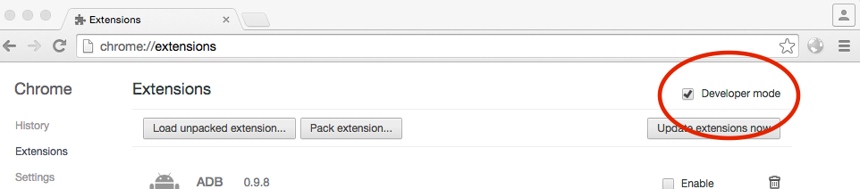

This application was written as part of the MediaScape EU project, to demonstrate some 
of the project's capabilities.

To install it as a simple demonstration, do the following:

## Install and run the example radio app and chrome extensions.

Clone each of the repositories.

    git clone https://github.com/mediascape/discovery-extension
    git clone https://github.com/mediascape/discovery-helper-app
    git clone https://github.com/mediascape/discovery-bbc-radio

Go to chrome://extensions in your Chrome browser (or open up the Chrome menu by clicking the icon to the far right of the Omnibox:  The menu's icon is three horizontal bars. Then select Extensions under the Tools menu to get to the same place).

Ensure that the Developer mode checkbox in the top right-hand corner is checked.

Click “Load unpacked extension…” to pop up a file-selection dialog.

Navigate to the directory in which your extension files live, and select it. Do this for all three.

Click “launch” on MediaScape Discovery Helper

## Install and run the "Radiodan" control interface and audio server

On a machine on the same network, install prerequisites:

    mpd, node, zeromq, go

In one window:

    mkdir go
    export GOPATH=$PWD/go
    export PATH=$PATH:$GOPATH/bin
    mkdir -p $GOPATH/src/github.com/radiodan
    cd $GOPATH/src/github.com/radiodan
    git clone https://github.com/radiodan/broker
    cd broker
    go get github.com/tools/godep
    $GOPATH/bin/godep restore
    go install
    cd ../../../../
    ./bin/broker

in another:

    git clone https://github.com/radiodan/radiodan.js.git
    cd radiodan.js/
    git fetch origin
    git checkout stable-v1
    cp config.json.example config.json
    npm install
    ./bin/server config.json 

In another:

    git clone https://github.com/mediascape/discovery-audio-stream-controller
    cd discovery-audio-stream-controller/
    npm install
    node main.js

And after a few moments you should see the MDNS discovery update in the toolbar of the Chrome browser:

Clicking on the name of the device takes you to a remote control page: 

which you can then use as a web-based remote control to control the audio coming through mpd on your computer:

